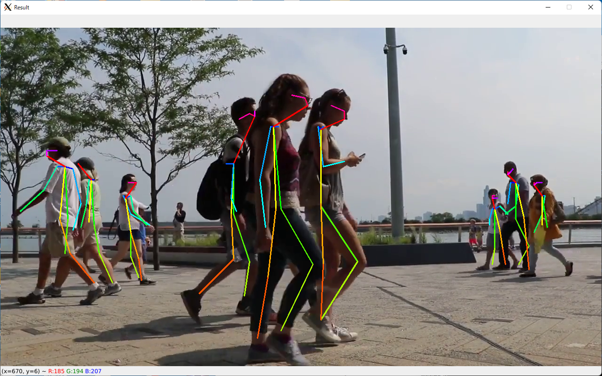
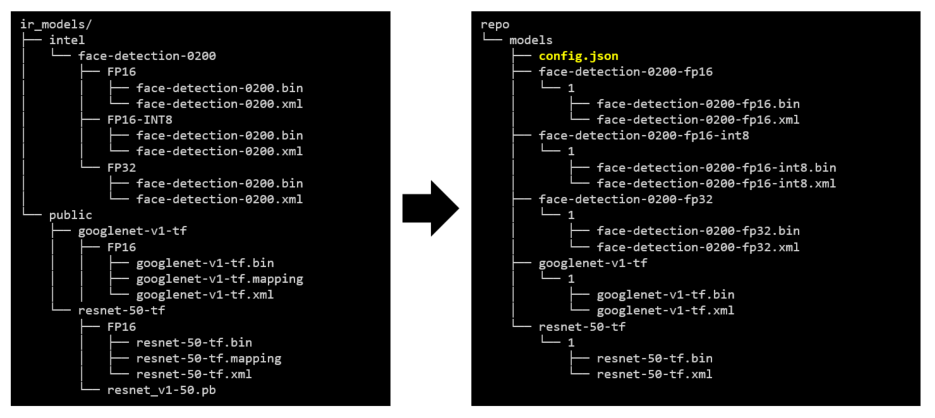
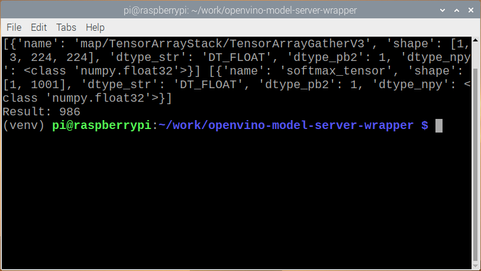

# OpenVINO Model Server wrapper API for Python
## Description
This project provides a Python wrapper class for [OpenVINO Model Server](https://github.com/openvinotoolkit/model_server) ('OVMS' in short).  
User can submit DL inference request to OVMS with just a few lines of code.  

This project also includes the [instruction to setup OpenVINO model server to support multiple models](#how-to-setup-openvino-model-server-for-multiple-model-support-ubuntu).

Also, the project provides [an automation Python script to generate OVMS model repository](#openvino-model-server---model-repository-setup-automation-tool) in a single line of command. Users can generate a model repository for OVMS by just  preparing a directory which contains multiple OpenVINO IR models, and running the script.

This wrapper API needs 'tensorflow' and 'tensorflow-serving-api' to run.  
For the users those don't want to install those big libraries, **this project provides an [alternative solution](#how-to-run-ovms-wrapper-api-without-having-tensorflow-and-tensorflow-serving-api)**. User can use bundled gRPC handler code in this project instead of installing TensorFlow and TensorFlow-serving-API. This alternative solution allows user to submit inference request to OVMS from non-IA client devices.  

The project also includes several [demo programs](#demo-programs) as user's reference.  




## Sample client inference code (Classification - ResNet-50)
```python
from ovms_wrapper.ovms_wrapper import OpenVINO_Model_Server

import cv2
import numpy as np

ovms = OpenVINO_Model_Server()
ovms.connect('127.0.0.1', 9000)
#print(ovms.get_model_status('resnet_50'))
model = ovms.open_model('resnet_50')
print(model.inputs, model.outputs)

# curl -O https://raw.githubusercontent.com/intel-iot-devkit/smart-video-workshop/master/Labs/daisy.jpg
image_file  = 'daisy.jpg'
img = cv2.imread(image_file)                # Read an image
res = model.single_image_infer(img)         # Infer
result = res[model.outputs[0].name]

# display result
nu = np.array(result)
ma = np.argmax(nu)
print("Result:", ma)
```

## Prerequisites
You need to install some Python modules.   
```sh
python3 -m pip install --update pip setuptools
python3 -m pip install -r requirements.txt
```
----
## How to setup OpenVINO Model Server (Single model support, Ubuntu)  
When you just need only single IR model to be served by OVMS, you don't need to have model repository. Just specify the model directory and give some information such as model name as option to start the OVMS docker container.   
This is the easiest way to start OVMS.  
Note: OVMS can run on Windows too. Please refer to the [official OVMS document](https://docs.openvino.ai/latest/openvino_docs_ovms.html) for details.  
1. Install prerequisites  
```sh
sudo apt update && sudo apt install -y docker.io python3-venv
python3 -m pip install --upgrade pip setuptools
python3 -m pip install tensorflow tensorflow-serving-api
```
2. Prepare a DL model  
Install OpenVINO for temporal use, and download and convert a model.  
**Note:** You don't need to re-create a new 'venv' if you already have one. Just activate it and use it.  
```sh
python3 -m venv venv__temp
. venv__temp/bin/activate
python3 -m pip install openvino-dev tensorflow
omz_downloader --name resnet-50-tf
omz_converter  --name resnet-50-tf --precisions FP16
deactivate
```
3. Start OpenVINO Model Server as a Docker container  
Docker will pull the pre-built '`openvino/model_server`' image from the Docker hub, create a container and run it.  
```sh
docker run -d --rm --name ovms \
  -v $PWD/public/resnet-50-tf/FP16:/models/resnet50/1 \
  -p 9000:9000 \
  openvino/model_server:latest \
  --model_path /models/resnet50 \
  --model_name resnet_50 \
  --port 9000
```
OVMS will start serving the Resnet-50 model as model-name='resnet_50', model-version=1, and gRPC-port=9000.  
Now you can run a sample client inference program to test the OVMS.  
**Note:** You can run the client code from any PC or node as long as it is IP reachable to the OVMS. You might need to modify the IP address in the client code accordingly.  

----
## How to setup OpenVINO Model Server for multiple model support (Ubuntu)  
OVMS requires a model repository which contains the IR models when you want to support multiple models. The repository must follow strict directory and file structure. Also, you need to create a model configuration file in JSON format.  
### Prepare the model directory with IR models and configuration files (JSON)  
1. Install prerequisites  
```sh
sudo apt update && sudo apt install -y docker.io python3-venv
python3 -m pip install --upgrade pip setuptools
python3 -m pip install tensorflow tensorflow-serving-api
```
2. Prepare DL models  
Install OpenVINO for temporal use, and download and convert the models.  
**Note1:** Following steps are summarized in `'setup_model_repository.[sh|.bat]`' shell script for user's convenience.  
**Note2:** You don't need to re-create a new 'venv' if you already have one. Just activate it and use it.  
**Note3:** '`face-detection-0200`' model is a Intel model. It is distributed as an OpenVINO IR model. You can use the model by just downloading it without conversion.   
```sh
python3 -m venv venv__temp
. venv__temp/bin/activate
python3 -m pip install openvino-dev tensorflow
omz_downloader --name resnet-50-tf,googlenet-v1-tf,face-detection-0200 --precisions FP16
omz_converter  --name resnet-50-tf,googlenet-v1-tf                     --precisions FP16
deactivate
```

3. Setup the model repository for OVMS.  
OVMS requires the IR models to be stored in a specific directory structure. You need to create a compatible directory tree structure and place IR models accordingly. Also, OVMS requires a repository configuration file (`config.json`). Please refer to the [official document](https://github.com/openvinotoolkit/model_server/blob/main/docs/docker_container.md#configfile) for details.  
**Note1:** `config.json` defines model specification in the model repository.  
**Note2:** `mapping_config.json` defines alias name for input and output blobs in the model. You can give fiendly name to those blobs for your convenience. This is optional.  
```sh
mkdir -p ./ovms_model_repository/models/resnet-50-tf/1
mkdir -p ./ovms_model_repository/models/googlenet-v1-tf/1
mkdir -p ./ovms_model_repository/models/face-detection-0200/1
cp ./public/resnet-50-tf/FP16/*       ./ovms_model_repository/models/resnet-50-tf/1/
cp ./public/googlenet-v1-tf/FP16/*    ./ovms_model_repository/models/googlenet-v1-tf/1/
cp ./intel/face-detection-0200/FP16/* ./ovms_model_repository/models/face-detection-0200/1/
cp ./model-config.json                ./ovms_model_repository/models/config.json
cp ./mapping_config-resnet-50-tf.json ./ovms_model_repository/models/resnet-50-tf/1/mapping_config.json
```

- The model repository directory structure after this operation will look like this.  
```
ovms_model_repository/
└── models
    ├── config.json                     # <- model configuration file
    ├── face-detection-0200
    │   └── 1                           # <- Model version number. A positive integer value
    │       ├── face-detection-0200.bin
    │       └── face-detection-0200.xml
    ├── googlenet-v1-tf
    │   └── 1
    │       ├── googlenet-v1-tf.bin
    │       ├── googlenet-v1-tf.mapping
    │       └── googlenet-v1-tf.xml
    └── resnet-50-tf
        └── 1
            ├── mapping_config.json     # <- in/out blob name alias definition. optional
            ├── resnet-50-tf.bin
            ├── resnet-50-tf.mapping
            └── resnet-50-tf.xml
```
- '`config.json`' file contains the model specifications. You can specify OpenVINO plugin options ('`plugin_config`'), target device ('`target_device`') and so on.  
**Note:** You need to use a specific Docker image if you want to use the integrated GPU. The Docker image name should be '`openvino/model-server:latest-gpu`'.  
```json
{
    "model_config_list":[
        {
            "config": {
                "name":"resnet_50",       # <- Model name which will be exposed to the clients
                "base_path":"/opt/models/resnet-50-tf",
                "batch_size":"1",
                "plugin_config": {"CPU_THROUGHPUT_STREAMS": "CPU_THROUGHPUT_AUTO"}
            }
        },
        {
            "config": {
                "name":"googlenet_v1",
                "base_path":"/opt/models/googlenet-v1-tf",
                "batch_size":"1",
                "nireq":4,
                "target_device":"CPU"
            }
        },
        {
            "config": {
                "name":"face-detection-0200",
                "base_path":"/opt/models/face-detection-0200"
            }
        }
    ]
}

```

4. Start OVMS Docker container with the model repository.  
Docker will pull the pre-built '`openvino/model_server`' image from the Docker hub, create a container and run it.  
```sh
docker run -d --rm --name ovms \
  -v $PWD/ovms_model_repository/models:/opt/models \
  -p 9000:9000 openvino/model_server:latest \
  --config_path=/opt/models/config.json \
  --port 9000
```

- If you want to use the integrated GPU, you need to use a specific Docker image with '`latest-gpu`' tag and add `'--device=/dev/dri`' option when you start the container. Please refer to the [officiel document](https://github.com/openvinotoolkit/model_server/blob/main/docs/docker_container.md#running-openvino-model-server-with-ai-accelerators-ncs-hddl-and-gpu-) for the datails.  
```sh
docker run -d --rm --name ovms \
  -v $PWD/ovms_model_repository/models:/opt/models \
  -p 9000:9000 openvino/model_server:latest-gpu \
  --device=/dev/dri \
  --config_path=/opt/models/config.json \
  --port 9000
```

Now OVMS serves '`resnet_50`', '`googlenet_v1`' and '`face-detection-0200`' models.

----

## OpenVINO Model Server - Model repository setup automation tool  
`setup_ovms_model_repo.py` in `./model-repo-generator/` searches OpenVINO IR models in the specified source directory and create an model repository for OpenVINO Model Server. It generates required `config.json` file as well.  
User can create the model repository with this script and just pass it to OVMS to start the inference service.   

|option|descriotion|
|----|----|
|`-m`, `-model_dir`| Source directory that contains OpenVINO IR models. Required.|
|`-o`, `-output_dir`| OVMS model repository directory to generate. Default='`./model_repository`'|
|`--verbose`|Verbose mode flag. Optional. Default=False|
|`--dryrun`|Dryrun flag. Nothing will be written nor generated if this flag is set. Useful with `--verbose` flag. Optional. Default=False|
- Command line example:
```sh
python3 model-repo-generator/setup_ovms_model_repo.py -m ir_models -o ovms_repo
```


## How to run OVMS wrapper API without having TensorFlow and tensorflow-serving-api  
TensorFlow and its dependency libraries take up about 2GB of storage space. You may not want to install TF in case the target device is a kind of small and not-powerful device such as low-power ARM based devices.  
This project offers an alternative solution to resolve this issue. You can use the bundled gRPC handler code instead of TF and TF-serving-api. With those gRPC handler code, it is not necessary to install TF and TF-serving-API to run the OVMS client codes.     
1. Rename directories  
Remove '`_`' on top of '`_tensorflow`' and '`_tensorflow_serving`' directory names.  
This operation would make a name space conflict of Python modules if you have already installed 'tensorflow' and 'tensorflow-serving-api' on your system. You must not have those Python modules.   
```bash
mv _tensorflow tensorflow
mv _tensorflow_serving tensorflow_serving
```
Now you can use the OVMS wrapper without having 'tensorflow' and 'tensorflow-serving-api'.   

**Note:** You can re-generate the gRPC handler codes from `.proto` files by running '`build_proto.sh`'.
```bash
./build_proto.sh
```
- You should have following directory structure to run your code properly.  
```
.
├── ovms_wrapper
├── tensorflow
├── tensorflow_serving
└── <YOUR_CODE.py>
```
**Exmple:** Running OVMS client program using OVMS wrapper on Raspbian OS (without Tensorflow installed)  


## Demo Programs  
You can try demo programs with OVMS wrapper.  
You need to download required models and start OVMS before you run the demo programs.

1. Setup OVMS  
[How to Setup OVMS for Demo Programs](./samples/ovms_setup_for_demos/README.md)

2. Human Pose Estimation demo  
You need to build a C++ based Python module to run demo.  
[How to run](./samples/human-pose-estimation-2d/README.md)  


3. Object Detection / Line Crossing / Area Intrusion demo  
[How to run](./samples/object-tracking-line-crossing-area-intrusion/README.md)  


END
