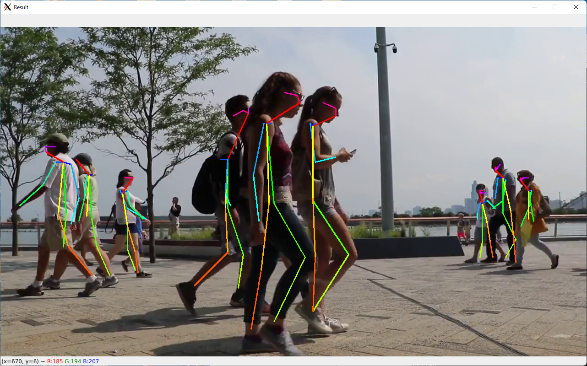

# Human Pose Estimation Demo for OVMS wrapper  

## Description  
This demo runs 'human-pose-estimation-0001' model with OpenVINO model server using OVMS wrapper library.  

## How to run
1. Build pose_extractor Python module  
Build a Python module and copy the built library file to the demo directory.
- Ubuntu
```sh
cd pose_extractor_src
mkdir -p build && cd build
cmake -DCMAKE_BUILD_TYPE=Release ..
make
cd ../..
cp pose_extractor_src/build/pose_extractor/pose_extractor.so .
```

- Windows 10/11
```sh
# Setup OpenVINO environment variables (to set the path to OpenCV libs)
call "%PROGRAMFILES(X86)%\Intel\openvino_2021\bin\setupvars.bat"
cd pose_extractor_src
mkdir build
cd build
# Setup environment variables for Visual Studio 2019
call "\Program Files (x86)\Microsoft Visual Studio\2019\Community\VC\Auxiliary\Build\vcvars64.bat"
cmake ..
cmake --build . --config Release
cd ..\..
copy pose_extractor_src\build\pose_extractor\Release\pose_extractor.pyd .
```

2. Copy OVMS wrapper library  
- Ubuntu
```sh
cp -r ../../ovms_wrapper .
```
- Windows 10/11
```sh
xcopy /E ..\..\ovms_wrapper\ ovms_wrapper\
```

* (Optional) Copy gRPC handler codes  
If you have installed TF and TF-serving-api, you can skip this operation.  
You can use gRPC handler codes instead of TF and TF-serving-api. This is useful when you want to run this demo on a small devices such as Raspberry Pi.  
- Ubuntu
```sh
cp -r ../../_tensorflow ./tensorflow
cp -r ../../_tensorflow_serving ./tensorflow_serving
```
- Windows 10/11
```sh
xcopy /E ..\..\_tensorflow\ tensorflow\
xcopy /E ..\..\_tensorflow_serving\ tensorflow_serving\
```

3. Install prerequisites for the demo
```sh
python3 -m venv venv
source venv/bin/activate
python3 -m pip install --upgrade pip setuptools
python3 -m pip install grpcio grpcio_tools numpy opencv-python
```

4. Setup and start OVMS  
Please refer to [`How to setup and start OpenVINO Model Server fot the demos`](../ovms_setup_for_demos) page to start OVMS.  

5. Run the demo program
```sh
python3 human-pose-estimation-2d.py
```


